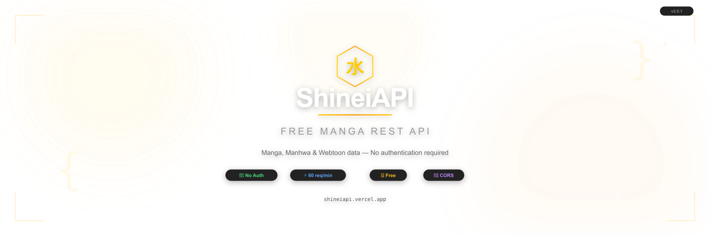

<div align="center">



<br />

# 水 ShineiAPI

### The Fastest Free Manga API Built on Toraka

**A free, open-source REST API for manga, manhwa, and webtoon data — no authentication required.**

Built as a middleware layer on top of the [Toraka](https://toraka.com) API with caching, rate limiting, error handling, and data normalization.

<br />

<a href="https://shineiapi.vercel.app/docs"></a>
<a href="https://shineiapi.vercel.app/api/v1/health"></a>
<a href="https://shineiapi.vercel.app/openapi.yaml"></a>

<br /><br />

<a href="https://github.com/Shineii86/ShineiAPI/blob/main/LICENSE"></a>
<a href="https://github.com/Shineii86/ShineiAPI/stargazers"></a>
<a href="https://github.com/Shineii86/ShineiAPI/network/members"></a>
<a href="https://github.com/Shineii86/ShineiAPI/issues"></a>
<a href="https://github.com/Shineii86/ShineiAPI/pulls"></a>
<a href="https://github.com/Shineii86/ShineiAPI/actions/workflows/ci.yml"></a>

<br />

<a href="https://nextjs.org"></a>
<a href="https://vercel.com"></a>
<a href="https://nodejs.org"></a>
<a href="https://tailwindcss.com"></a>
<a href="https://www.openapis.org/"></a>

<br /><br />

<a href="https://shineiapi.vercel.app/docs"><strong>📖 Documentation</strong></a> ·
<a href="https://shineiapi.vercel.app/docs#try-it"><strong>🎮 API Playground</strong></a> ·
<a href="https://shineiapi.vercel.app/api/v1/health"><strong>💚 Health Status</strong></a> ·
<a href="https://editor.swagger.io/?url=https://shineiapi.vercel.app/openapi.yaml"><strong>🔧 API Explorer</strong></a> ·
<a href="https://github.com/Shineii86/ShineiAPI/issues/new?assignees=&labels=bug&template=bug_report.md"><strong>🐛 Report Bug</strong></a> ·
<a href="https://github.com/Shineii86/ShineiAPI/issues/new?assignees=&labels=enhancement&template=feature_request.md"><strong>✨ Request Feature</strong></a>

</div>

---

## 📑 Table of Contents

- [About](#-about)
- [Why ShineiAPI?](#-why-shineiapi)
- [Key Features](#-key-features)
- [Quick Start](#-quick-start)
- [Base URL](#-base-url)
- [API Endpoints](#-api-endpoints)
  - [Browse Series](#browse-series)
  - [Series Detail](#series-detail)
  - [Chapter List](#chapter-list)
  - [Search](#search)
  - [Popular & Trending](#popular--trending)
  - [Random Series](#random-series)
  - [Top Rated](#top-rated)
  - [Release Schedule](#release-schedule)
  - [Genres](#genres)
  - [Health Check](#health-check)
  - [Stats](#stats)
- [Response Format](#-response-format)
- [Rate Limiting](#-rate-limiting)
- [Caching](#-caching)
- [Error Handling](#-error-handling)
- [Request Headers](#-request-headers)
- [OpenAPI Specification](#-openapi-specification)
- [Code Examples](#-code-examples)
- [Tech Stack](#-tech-stack)
- [Project Structure](#-project-structure)
- [Local Development](#-local-development)
- [Deployment](#-deployment)
- [Contributing](#-contributing)
- [FAQ](#-faq)
- [Legal](#-legal)
- [Changelog](#-changelog)
- [License](#-license)
- [Acknowledgments](#-acknowledgments)

---

## 📖 About

**ShineiAPI** is a free, public REST API that provides comprehensive manga, manhwa, and webtoon data. It acts as a middleware layer on top of the [Toraka](https://toraka.com) API, adding:

- **In-memory caching** with configurable TTL for fast responses
- **Rate limiting** with sliding window algorithm (60 req/min per IP)
- **Data normalization** for consistent, predictable JSON responses
- **Error handling** with descriptive messages and proper HTTP status codes
- **CORS support** for direct browser access from any origin

Whether you're building a manga reader app, a recommendation engine, a tracking tool, or a content aggregator — ShineiAPI gives you the data you need with a clean, consistent interface.

> **Why "Shinei"?** — From Japanese 「新鋭」(shin'ei), meaning **"new talent"** or **"rising star"** — reflecting the fresh, rising content this API helps discover.

---

## 🌟 Why ShineiAPI?

| | ShineiAPI | Other APIs |
|---|---|---|
| **Authentication** | ✅ None required | ❌ API keys, OAuth |
| **Rate Limit** | ✅ 60 req/min | ⚠️ Often lower or paid |
| **Response Format** | ✅ Consistent envelope | ❌ Varies by endpoint |
| **Caching** | ✅ Built-in (5–15 min) | ❌ Manual |
| **CORS** | ✅ All origins | ⚠️ Restricted |
| **Cost** | ✅ Free forever | ❌ Freemium/paid |
| **Focus** | ✅ Manga & manhwa | ⚠️ Often anime-first |

---

## ✨ Key Features

| Feature | Description |
|---------|-------------|
| 📚 **Comprehensive Data** | Titles, synopses, ratings, chapters, genres, authors, artists, cover images, alt titles, popularity ranks |
| ⚡ **Sub-Second Responses** | In-memory caching with configurable TTL (5 min series, 10 min search, 15 min rankings) |
| 🔍 **Full-Text Search** | Search across thousands of series by title with optional genre, source, type, and status filters |
| 📖 **Chapter Tracking** | Detailed chapter info including release dates, sources, lock status, and publication order |
| 🎲 **Discovery Tools** | Random series, popular/trending lists, top-rated rankings, release schedules |
| 🔓 **Zero Authentication** | No API keys, no sign-ups, no OAuth dances. Just make a request and get JSON. |
| 🌐 **CORS Ready** | Call directly from any frontend — browser, mobile, desktop, browser extension |
| 🛡️ **Rate Limiting** | 60 req/min per IP with informative headers (`X-RateLimit-*`, `Retry-After`) |
| 📄 **Consistent Envelope** | Every response follows `{ success, data, pagination? }` — no surprises |
| 🏥 **Health Monitoring** | `/api/v1/health` endpoint with upstream probe, cache stats, and uptime |
| 📋 **OpenAPI Spec** | Full OpenAPI 3.1 specification for code generation, testing, and documentation |
| 🔍 **Request Tracing** | `X-Request-ID` header on every response for debugging and logging |
| 📊 **Public Stats** | `/api/v1/stats` endpoint with uptime, cache metrics, and endpoint count |
| 🎮 **Live API Playground** | Interactive endpoint testing with parameter inputs, live JSON response preview, and syntax highlighting |
| 📜 **Terms & Privacy** | Full Terms of Service and Privacy Policy pages included |
| 🎨 **Neo-Brutalist × Apple UI** | Bold personality with Apple polish — frosted glass nav, soft layered shadows, spring animations, pill badges, warm cream palette |
| 🔍 **Docs Search** | ⌘K searchable modal with keyboard navigation across all endpoints and features |
| 🏎️ **Performance Optimized** | Dynamic imports for heavy components, self-hosted fonts via `next/font`, shared component library, zero redundant code |
| 📜 **Infinite Marquee** | Seamless looping keyword banner on landing page — pauses on hover, responsive on mobile |

---

## 🚀 Quick Start

**No API key needed.** Just make a request:

```bash
# Get a series
curl https://shineiapi.vercel.app/api/v1/series/solo-leveling

# Search for a series
curl "https://shineiapi.vercel.app/api/v1/search?q=nano+machine"

# Get a random series
curl https://shineiapi.vercel.app/api/v1/random

# Check API health
curl https://shineiapi.vercel.app/api/v1/health
```

<details>
<summary><strong>🎮 Try it in JavaScript</strong></summary>

```javascript
const res = await fetch('https://shineiapi.vercel.app/api/v1/series/solo-leveling');
const { success, data } = await res.json();

if (success) {
  console.log(data.title);     // "Solo Leveling"
  console.log(data.rating);    // 9.8
  console.log(data.chapters);  // 201
}
```

</details>

---

## 🌐 Base URL

```
https://shineiapi.vercel.app/api/v1
```

| Property | Value |
|----------|-------|
| **Protocol** | HTTPS only (HTTP auto-redirects) |
| **Method** | GET only (all endpoints) |
| **Auth** | None required |
| **CORS** | All origins allowed |
| **Content-Type** | `application/json` |
| **Rate Limit** | 60 requests/min per IP |

---

## 📡 API Endpoints

### Browse Series

```
GET /api/v1/series
```

Browse all series with filtering, sorting, and pagination.

| Parameter | Type | Required | Default | Description |
|-----------|------|----------|---------|-------------|
| `page` | integer | No | `1` | Page number |
| `sort` | string | No | `popularity_rank` | Sort field: `popularity_rank`, `trending_rank`, `rating`, `updated_at`, `created_at` |
| `genre` | string | No | — | Genre slug filter (e.g., `action`, `fantasy`, `romance`) |
| `q` | string | No | — | Search string to filter results |

```bash
# Browse all series (default: popularity)
curl https://shineiapi.vercel.app/api/v1/series

# Sort by rating, filter by genre
curl "https://shineiapi.vercel.app/api/v1/series?sort=rating&genre=action&page=2"

# Search within browse
curl "https://shineiapi.vercel.app/api/v1/series?q=tower&sort=popularity_rank"
```

---

### Series Detail

```
GET /api/v1/series/{slug}
```

Get complete information for a single series including metadata, ratings, cover images, authors, artists, and official sources.

| Parameter | Type | Required | Description |
|-----------|------|----------|-------------|
| `slug` | string | **Yes** | URL-friendly series identifier (e.g., `solo-leveling`, `nano-machine`). Spaces and special characters are auto-normalized. |
| `include` | string | No | Pass `include=chapters` to embed the full chapter list in the response |

> **💡 Slug Normalization:** The API automatically normalizes slugs — spaces, underscores, and special characters are converted to hyphens. Both `/series/nano machine` and `/series/nano%20machine` resolve to `/series/nano-machine`.

```bash
# Standard response (chapters stripped)
curl https://shineiapi.vercel.app/api/v1/series/solo-leveling

# Spaces in slug are auto-normalized
curl https://shineiapi.vercel.app/api/v1/series/nano%20machine

# With full chapter list included
curl "https://shineiapi.vercel.app/api/v1/series/solo-leveling?include=chapters"
```

<details>
<summary><strong>📋 Full Response Example</strong></summary>

```json
{
  "success": true,
  "data": {
    "id": "abc-123",
    "title": "Solo Leveling",
    "slug": "solo-leveling",
    "synopsis": "In a world where hunters must battle deadly monsters...",
    "rating": 9.8,
    "status": "Completed",
    "type": "Manhwa",
    "genres": [
      { "id": "...", "name": "Action", "slug": "action" },
      { "id": "...", "name": "Adventure", "slug": "adventure" },
      { "id": "...", "name": "Fantasy", "slug": "fantasy" }
    ],
    "authors": [{ "id": "...", "name": "Chugong", "slug": "chugong" }],
    "artists": [{ "id": "...", "name": "Jang Sung-Rak", "slug": "jang-sung-rak" }],
    "alt_titles": ["나 혼자만 레벨업", "Solo Leveling", "I Level Up Alone"],
    "cover": {
      "small": "https://media.toraka.com/.../small.webp",
      "large": "https://media.toraka.com/.../large.webp"
    },
    "official_sources": [
      { "name": "KakaoPage", "url": "https://page.kakao.com/...", "language": "ko", "type": "original" }
    ],
    "popularity_rank": 1,
    "score_ranking": 12,
    "rating_count": 5420,
    "bookmarks_count": 12840,
    "chapters_count": 201,
    "chapters": [
      {
        "id": "ch-201",
        "order": 201,
        "title": "Chapter 201",
        "source": "KakaoPage",
        "published_at": "2023-05-10T00:00:00.000Z"
      }
    ]
  },
  "timestamp": "2026-05-03T12:00:00.000Z"
}
```

</details>

---

### Chapter List

```
GET /api/v1/series/{slug}/chapters
```

Get all chapters for a series with metadata including release dates, sources, and lock status.

| Parameter | Type | Required | Description |
|-----------|------|----------|-------------|
| `slug` | string | **Yes** | Series slug identifier |

```bash
curl https://shineiapi.vercel.app/api/v1/series/solo-leveling/chapters
```

<details>
<summary><strong>📋 Response Example</strong></summary>

```json
{
  "success": true,
  "data": [
    {
      "id": "ch-001",
      "number": "Chapter 1",
      "identifier": "ch-1",
      "title": "Chapter 1",
      "subtitle": null,
      "released": "2018-03-04T00:00:00Z",
      "is_locked": false,
      "sources": [
        { "id": "...", "name": "KakaoPage", "slug": "kakao-page", "url": "https://..." }
      ]
    }
  ],
  "timestamp": "2026-05-03T12:00:00.000Z"
}
```

</details>

---

### Search

```
GET /api/v1/search?q={query}
```

Full-text search with optional filters. **Fully backward compatible** — only `q` is required.

| Parameter | Type | Required | Default | Description |
|-----------|------|----------|---------|-------------|
| `q` | string | **Yes** | — | Search query (minimum 2 characters) |
| `page` | integer | No | `1` | Page number |
| `genre` | string | No | — | Genre slug filter (e.g., `action`, `fantasy`) |
| `source` | string | No | — | Source name filter (e.g., `kakao-page`) |
| `type` | string | No | — | Content type (e.g., `manhwa`, `manga`, `webtoon`) |
| `status` | string | No | — | Release status (e.g., `releasing`, `completed`) |

```bash
# Basic search (backward compatible)
curl "https://shineiapi.vercel.app/api/v1/search?q=tower+of+god"

# Search with filters
curl "https://shineiapi.vercel.app/api/v1/search?q=solo&genre=action&type=manhwa&status=completed"

# Paginated search
curl "https://shineiapi.vercel.app/api/v1/search?q=nano&page=2"
```

---

### Popular & Trending

```
GET /api/v1/popular
```

Get popular or trending series.

| Parameter | Type | Required | Default | Description |
|-----------|------|----------|---------|-------------|
| `page` | integer | No | `1` | Page number |
| `type` | string | No | `popular` | `popular` or `trending` |

```bash
# Popular series
curl https://shineiapi.vercel.app/api/v1/popular

# Trending series, page 2
curl "https://shineiapi.vercel.app/api/v1/popular?type=trending&page=2"
```

---

### Random Series

```
GET /api/v1/random
```

Returns a random series from a curated list of popular titles. Great for discovery features.

```bash
curl https://shineiapi.vercel.app/api/v1/random
```

---

### Top Rated

```
GET /api/v1/top
```

Returns the highest-rated series sorted by rating in descending order.

| Parameter | Type | Required | Default | Description |
|-----------|------|----------|---------|-------------|
| `limit` | integer | No | `10` | Number of results (max 20) |

```bash
# Top 10 (default)
curl https://shineiapi.vercel.app/api/v1/top

# Top 5
curl "https://shineiapi.vercel.app/api/v1/top?limit=5"
```

---

### Release Schedule

```
GET /api/v1/schedule
```

Returns release schedule organized by day of the week.

| Parameter | Type | Required | Description |
|-----------|------|----------|-------------|
| `day` | string | No | Day of the week (e.g., `monday`, `tuesday`) |

```bash
# Full weekly schedule
curl https://shineiapi.vercel.app/api/v1/schedule

# Monday releases only
curl "https://shineiapi.vercel.app/api/v1/schedule?day=monday"
```

---

### Genres

```
GET /api/v1/genres
```

Returns all supported genres with names, slugs, and descriptions.

```bash
curl https://shineiapi.vercel.app/api/v1/genres
```

<details>
<summary><strong>📋 Response Example</strong></summary>

```json
{
  "success": true,
  "data": [
    { "slug": "action", "name": "Action", "description": "High-energy stories featuring physical feats, combat, and adrenaline-pumping sequences." },
    { "slug": "fantasy", "name": "Fantasy", "description": "Stories set in worlds with magic, mythical creatures, and supernatural elements." },
    { "slug": "romance", "name": "Romance", "description": "Stories centered on love, relationships, and emotional connections." }
  ],
  "timestamp": "2026-05-03T12:00:00.000Z"
}
```

</details>

---

### Health Check

```
GET /api/v1/health
```

Returns API health status, upstream Toraka connectivity, cache statistics, and uptime. Returns `503` when upstream is degraded.

```bash
curl https://shineiapi.vercel.app/api/v1/health
```

<details>
<summary><strong>📋 Response Example</strong></summary>

```json
{
  "success": true,
  "data": {
    "status": "healthy",
    "version": "2.0.3",
    "uptime": { "ms": 86400000, "human": "1d 0h 0m" },
    "checks": {
      "api": "healthy",
      "upstream": "healthy",
      "cache": "healthy",
      "cacheStats": {
        "entries": 42,
        "maxEntries": 1000,
        "hitRate": "78.5%",
        "hits": 1520,
        "misses": 418
      }
    },
    "timestamp": "2026-05-03T12:00:00.000Z"
  }
}
```

</details>

---

### Stats

```
GET /api/v1/stats
```

Returns public API statistics including uptime, cache hit rate, and endpoint count.

```bash
curl https://shineiapi.vercel.app/api/v1/stats
```

<details>
<summary><strong>📋 Response Example</strong></summary>

```json
{
  "success": true,
  "data": {
    "name": "ShineiAPI",
    "version": "2.0.3",
    "uptime": { "ms": 86400000, "human": "1d 0h 0m" },
    "cache": {
      "entries": 42,
      "hitRate": "78.5%",
      "hits": 1520,
      "misses": 418
    },
    "endpoints": 10,
    "rate_limit": { "max_requests": 60, "window": "60s" }
  }
}
```

</details>

---

## 📋 Response Format

Every API response follows a consistent envelope format:

### Success

```json
{
  "success": true,
  "data": { ... },
  "timestamp": "2026-05-03T12:00:00.000Z"
}
```

### Success with Pagination

```json
{
  "success": true,
  "data": [...],
  "pagination": {
    "last_visible_page": 10,
    "has_next_page": true,
    "current_page": 1,
    "items": {
      "count": 25,
      "total": 250,
      "per_page": 25
    }
  },
  "timestamp": "2026-05-03T12:00:00.000Z"
}
```

### Error

```json
{
  "success": false,
  "error": {
    "code": "SERIES_NOT_FOUND",
    "message": "Series 'invalid-slug' not found. Check the slug and try again.",
    "status": 404
  },
  "timestamp": "2026-05-03T12:00:00.000Z"
}
```

---

## 🛡️ Rate Limiting

| Setting | Value |
|---------|-------|
| **Limit** | 60 requests per minute |
| **Window** | Rolling 60-second window |
| **Scope** | Per IP address |

### Response Headers

Every API response includes rate limit information:

| Header | Description |
|--------|-------------|
| `X-RateLimit-Limit` | Maximum requests allowed (60) |
| `X-RateLimit-Remaining` | Requests remaining in current window |
| `X-Request-ID` | Unique request ID for tracing |
| `Retry-After` | Seconds to wait (only on 429 responses) |

### Handling Rate Limits

```javascript
const response = await fetch('https://shineiapi.vercel.app/api/v1/series/solo-leveling');

if (response.status === 429) {
  const retryAfter = response.headers.get('Retry-After');
  console.log(`Rate limited. Retry after ${retryAfter} seconds.`);
  await new Promise(r => setTimeout(r, retryAfter * 1000));
  // Retry the request...
}

// Track request ID for debugging
const requestId = response.headers.get('X-Request-ID');
console.log(`Request ID: ${requestId}`);
```

---

## ⚡ Caching

| Resource | Cache TTL | Description |
|----------|-----------|-------------|
| Series detail | 5 minutes | Individual series data |
| Browse series | 5 minutes | Series listing with filters |
| Chapter lists | 5 minutes | Chapter listings per series |
| Search results | 10 minutes | Search query results |
| Popular/Trending | 5 minutes | Popular and trending lists |
| Top/Schedule | 15 minutes | Rankings and schedules |
| Random series | 2 minutes | Random endpoint (shorter for variety) |
| Genres | ∞ (static) | Genre list rarely changes |

Responses include Vercel's CDN cache headers (`Cache-Control: s-maxage=300`), so edge caching further reduces latency for repeated requests.

---

## ❌ Error Handling

### HTTP Status Codes

| Code | Status | Description |
|------|--------|-------------|
| `200` | OK | Request successful |
| `400` | Bad Request | Invalid parameters or missing required fields |
| `404` | Not Found | The requested resource does not exist |
| `429` | Too Many Requests | Rate limit exceeded (60 req/min) |
| `502` | Bad Gateway | Upstream API returned an error |
| `503` | Service Unavailable | API is degraded (check `/health`) |
| `504` | Gateway Timeout | Upstream API request timed out |

### Error Codes

| Code | Description |
|------|-------------|
| `MISSING_QUERY` | Search query `q` is required |
| `QUERY_TOO_SHORT` | Search query must be at least 2 characters |
| `MISSING_SLUG` | Series slug is required |
| `SERIES_NOT_FOUND` | No series found with the given slug |
| `INVALID_SORT` | Invalid sort parameter |
| `INVALID_PAGE` | Page must be a positive integer |
| `INVALID_TYPE` | Invalid popular/trending type |
| `INVALID_DAY` | Invalid day of the week |
| `RATE_LIMIT_EXCEEDED` | Too many requests (60/min) |
| `UPSTREAM_TIMEOUT` | Toraka API request timed out |
| `UPSTREAM_ERROR` | Toraka API returned an error |
| `UPSTREAM_RATE_LIMIT` | Toraka API rate limit hit |
| `INTERNAL_ERROR` | Unexpected server error |

---

## 📨 Request Headers

### Sent by ShineiAPI

| Header | Value | Description |
|--------|-------|-------------|
| `Content-Type` | `application/json` | Response format |
| `X-Powered-By` | `ShineiAPI v2.0.3` | API identifier |
| `X-RateLimit-Limit` | `60` | Max requests per window |
| `X-RateLimit-Remaining` | `59` | Remaining requests |
| `X-Request-ID` | `uuid` | Unique request ID |
| `X-API-Version | `2.0.3` | API version | API version |
| `Access-Control-Allow-Origin` | `*` | CORS allowed origin |
| `Cache-Control` | `public, s-maxage=300` | CDN cache directive |

### Accepted by ShineiAPI

| Header | Description |
|--------|-------------|
| `Accept` | `application/json` (default) |
| `Origin` | Used for CORS |
| `X-Forwarded-For` | Client IP detection |
| `X-Real-IP` | Client IP detection |

---

## 📋 OpenAPI Specification

ShineiAPI provides a full **OpenAPI 3.1** specification for machine-readable API documentation.

| Resource | URL |
|----------|-----|
| **Spec File** | [`/openapi.yaml`](https://shineiapi.vercel.app/openapi.yaml) |
| **Swagger UI** | [Open in Editor](https://editor.swagger.io/?url=https://shineiapi.vercel.app/openapi.yaml) |
| **Postman** | Import the spec directly into Postman |
| **Code Generators** | Use `openapi-generator` to generate SDKs in any language |

```bash
# Download the spec
curl https://shineiapi.vercel.app/openapi.yaml

# Generate a Python SDK
npx @openapitools/openapi-generator-cli generate \
  -i https://shineiapi.vercel.app/openapi.yaml \
  -g python \
  -o ./shineiapi-python
```

---

## 💻 Code Examples

<details>
<summary><strong>JavaScript (fetch)</strong></summary>

```javascript
// Get series details
const res = await fetch('https://shineiapi.vercel.app/api/v1/series/solo-leveling');
const { success, data } = await res.json();

if (success) {
  console.log(`Title: ${data.title}`);
  console.log(`Rating: ${data.rating}`);
  console.log(`Chapters: ${data.chapters_count}`);
  console.log(`Status: ${data.status}`);
}

// Search with filters
const search = await fetch(
  'https://shineiapi.vercel.app/api/v1/search?q=nano+machine&genre=action'
);
const { data: results } = await search.json();
results.forEach(series => {
  console.log(`${series.title} — ${series.rating} ⭐`);
});

// Random discovery
const random = await fetch('https://shineiapi.vercel.app/api/v1/random');
const { data: randomSeries } = await random.json();
console.log(`Try this: ${randomSeries.title}`);
```

</details>

<details>
<summary><strong>JavaScript (axios)</strong></summary>

```javascript
import axios from 'axios';

const api = axios.create({
  baseURL: 'https://shineiapi.vercel.app/api/v1',
});

// Browse with filters
const { data } = await api.get('/series', {
  params: { sort: 'rating', genre: 'fantasy', page: 1 }
});

data.data.forEach((series, i) => {
  console.log(`#${i + 1} ${series.title} — Rating: ${series.rating}`);
});

// Popular trending
const trending = await api.get('/popular', { params: { type: 'trending' } });
console.log(`Trending: ${trending.data.data.length} series`);
```

</details>

<details>
<summary><strong>Python</strong></summary>

```python
import requests

BASE_URL = "https://shineiapi.vercel.app/api/v1"

# Get a random series
response = requests.get(f"{BASE_URL}/random")
data = response.json()

if data["success"]:
    series = data["data"]
    print(f"Title: {series['title']}")
    print(f"Rating: {series['rating']}")
    print(f"Type: {series['type']}")
    print(f"Genres: {', '.join(g['name'] for g in series['genres'])}")

# Search with filters
response = requests.get(f"{BASE_URL}/search", params={
    "q": "tower of god",
    "genre": "fantasy",
    "type": "manhwa"
})
results = response.json()["data"]
for series in results:
    print(f"{series['title']}: {series['chapters_count']} chapters")

# Browse sorted by rating
response = requests.get(f"{BASE_URL}/series", params={
    "sort": "rating",
    "genre": "action",
    "page": 1
})
top_series = response.json()["data"]
for s in top_series[:5]:
    print(f"{s['title']} — {s['rating']} ⭐")
```

</details>

<details>
<summary><strong>cURL + jq</strong></summary>

```bash
# Get series details
curl -s https://shineiapi.vercel.app/api/v1/series/solo-leveling | jq '.data.title'

# Search and extract names
curl -s "https://shineiapi.vercel.app/api/v1/search?q=eleceed" | jq '.data[].title'

# Browse top-rated fantasy
curl -s "https://shineiapi.vercel.app/api/v1/series?sort=rating&genre=fantasy" | jq '.data[0:5]'

# Get chapters count
curl -s https://shineiapi.vercel.app/api/v1/series/nano-machine/chapters | jq '.data | length'

# Health check
curl -s https://shineiapi.vercel.app/api/v1/health | jq '.data.status'

# Pretty print random series
curl -s https://shineiapi.vercel.app/api/v1/random | jq .
```

</details>

<details>
<summary><strong>Go</strong></summary>

```go
package main

import (
    "encoding/json"
    "fmt"
    "net/http"
)

type Response struct {
    Success bool        `json:"success"`
    Data    interface{} `json:"data"`
}

func main() {
    // Get series
    resp, _ := http.Get("https://shineiapi.vercel.app/api/v1/series/solo-leveling")
    defer resp.Body.Close()

    var result Response
    json.NewDecoder(resp.Body).Decode(&result)
    fmt.Printf("Success: %v\n", result.Success)

    // Check health
    health, _ := http.Get("https://shineiapi.vercel.app/api/v1/health")
    defer health.Body.Close()
    fmt.Printf("Health Status: %d\n", health.StatusCode)
}
```

</details>

<details>
<summary><strong>PHP</strong></summary>

```php
<?php
// Get series details
$response = file_get_contents('https://shineiapi.vercel.app/api/v1/series/solo-leveling');
$data = json_decode($response, true);

if ($data['success']) {
    echo "Title: " . $data['data']['title'] . "\n";
    echo "Rating: " . $data['data']['rating'] . "\n";
}

// Search with filters
$search = file_get_contents(
    'https://shineiapi.vercel.app/api/v1/search?q=naruto&genre=action'
);
$results = json_decode($search, true);
foreach ($results['data'] as $series) {
    echo $series['title'] . "\n";
}
?>
```

</details>

<details>
<summary><strong>Ruby</strong></summary>

```ruby
require 'net/http'
require 'json'

# Get series
uri = URI('https://shineiapi.vercel.app/api/v1/series/solo-leveling')
response = JSON.parse(Net::HTTP.get(uri))

puts "Title: #{response['data']['title']}"
puts "Rating: #{response['data']['rating']}"

# Search
uri = URI('https://shineiapi.vercel.app/api/v1/search?q=tower+of+god&genre=fantasy')
search = JSON.parse(Net::HTTP.get(uri))
search['data'].each { |s| puts "#{s['title']} — #{s['rating']}⭐" }
```

</details>

---

## 🛠️ Tech Stack

| Component | Technology | Purpose |
|-----------|------------|---------|
| **Runtime** | Node.js 18+ | Server-side JavaScript |
| **Framework** | Next.js 14 (App Router) | API routes, SSR, middleware |
| **Data Source** | Toraka API | Upstream manga/manhwa data |
| **Caching** | In-memory (Map) | Response caching with configurable TTL |
| **Rate Limiting** | Custom middleware | Sliding window algorithm per IP |
| **Styling** | Tailwind CSS 3 | Neo-brutalist × Apple hybrid — frosted glass, soft shadows, spring animations |
| **Deployment** | Vercel | Serverless edge functions |
| **CI/CD** | GitHub Actions | Automated lint + build |
| **Documentation** | OpenAPI 3.1 | Machine-readable API spec |
| **API Playground** | Client-side Fetch | Live endpoint testing with JSON preview |
| **Version Control** | Git / GitHub | Source code management |

---

## 📁 Project Structure

```
ShineiAPI/
├── .github/
│   └── workflows/
│       └── ci.yml                        # GitHub Actions CI pipeline
├── public/
│   ├── banner.svg/png                    # Neo-brutalist README banner
│   ├── favicon.svg                       # Site favicon
│   ├── logo.png / logo.svg               # Logo (raster + vector)
│   ├── og-image.png                      # Open Graph social image
│   ├── openapi.yaml                      # OpenAPI 3.1 specification
│   ├── robots.txt                        # Search engine crawl rules
│   ├── sitemap.xml                       # XML sitemap for SEO
│   └── screenshots/                      # Documentation screenshots
├── src/
│   ├── app/
│   │   ├── api/v1/
│   │   │   ├── genres/route.js           # GET /api/v1/genres
│   │   │   ├── health/route.js           # GET /api/v1/health
│   │   │   ├── popular/route.js          # GET /api/v1/popular
│   │   │   ├── random/route.js           # GET /api/v1/random
│   │   │   ├── schedule/route.js         # GET /api/v1/schedule
│   │   │   ├── search/route.js           # GET /api/v1/search
│   │   │   ├── series/
│   │   │   │   ├── route.js              # GET /api/v1/series (browse)
│   │   │   │   └── [slug]/
│   │   │   │       ├── route.js          # GET /api/v1/series/:slug
│   │   │   │       └── chapters/
│   │   │   │           └── route.js      # GET /api/v1/series/:slug/chapters
│   │   │   ├── stats/route.js            # GET /api/v1/stats
│   │   │   └── top/route.js              # GET /api/v1/top
│   │   ├── browse/
│   │   │   ├── BrowseContent.js          # Live browse page with search, trending, popular
│   │   │   ├── page.js                   # Browse route
│   │   │   ├── genres/
│   │   │   │   ├── GenresContent.js      # Genre grid with color-coded cards
│   │   │   │   └── page.js               # Genres route
│   │   │   └── series/[slug]/
│   │   │       ├── SeriesContent.js      # Deep-linkable series detail page
│   │   │       └── page.js               # Series route with dynamic OG metadata
│   │   ├── docs/
│   │   │   ├── layout.js                 # Docs layout with sidebar
│   │   │   └── page.js                   # Full API documentation
│   │   ├── terms/page.js                 # Terms of Service
│   │   ├── privacy/page.js               # Privacy Policy
│   │   ├── support/page.js               # Support & FAQ page
│   │   ├── not-found.js                  # Custom 404 page
│   │   ├── error.js                      # Root error boundary
│   │   ├── loading.js                    # Root loading state
│   │   ├── globals.css                   # Design system (tokens, animations)
│   │   ├── layout.js                     # Root layout with SEO metadata
│   │   └── page.js                       # Landing page
│   ├── components/
│   │   ├── icons.js                      # SVG icon library (35+ icons)
│   │   ├── ApiPlayground.js              # Live API testing playground
│   │   ├── BackToTop.js                  # Back-to-top floating button
│   │   ├── DocsSearch.js                 # ⌘K searchable docs modal
│   │   ├── Footer.js                     # Shared footer component
│   │   ├── LandingNav.js                 # Landing page frosted nav
│   │   ├── LegalLayout.js               # Shared layout for ToS/Privacy/Support
│   │   └── ScrollProgress.js             # Scroll progress bar
│   ├── lib/
│   │   ├── cache.js                      # In-memory cache with TTL
│   │   ├── constants.js                  # Config, genres, types, statuses
│   │   ├── response.js                   # Standardized response builders
│   │   └── toraka.js                     # Toraka API client with caching
│   └── middleware.js                     # Rate limiting, CORS, X-Request-ID
├── .env.example                          # Environment variable template
├── .gitignore
├── CHANGELOG.md                          # Version history
├── CONTRIBUTING.md                       # Contribution guidelines
├── LICENSE                               # MIT License
├── README.md                             # This file
├── jsconfig.json                         # JavaScript path aliases
├── next.config.mjs                       # Next.js configuration
├── package.json                          # Dependencies and scripts
├── postcss.config.js                     # PostCSS configuration
├── sitemap.config.js                     # Sitemap generation config
├── tailwind.config.js                    # Tailwind CSS configuration
└── vercel.json                           # Vercel deployment config
```

---

## 🧑‍💻 Local Development

### Prerequisites

- [Node.js](https://nodejs.org/) 18 or later
- [npm](https://npmjs.com/) 9 or later
- [Git](https://git-scm.com/)

### Setup

```bash
# 1. Clone the repository
git clone https://github.com/Shineii86/ShineiAPI.git
cd ShineiAPI

# 2. Install dependencies
npm install

# 3. Copy environment file
cp .env.example .env.local

# 4. Start development server
npm run dev
```

The API will be available at [http://localhost:3000](http://localhost:3000).

### Available Scripts

| Script | Command | Description |
|--------|---------|-------------|
| `npm run dev` | `next dev` | Start development server with hot reload |
| `npm run build` | `next build` | Build for production |
| `npm start` | `next start` | Start production server |
| `npm run lint` | `next lint` | Run ESLint |

### Testing Locally

```bash
# Health check
curl http://localhost:3000/api/v1/health

# Browse series
curl "http://localhost:3000/api/v1/series?sort=rating&genre=action"

# Search with filters
curl "http://localhost:3000/api/v1/search?q=solo&status=completed"

# Random series
curl http://localhost:3000/api/v1/random

# Top rated
curl http://localhost:3000/api/v1/top
```

### Environment Variables

| Variable | Default | Description |
|----------|---------|-------------|
| `TORAKA_BASE_URL` | `https://core.toraka.com/api/v1` | Upstream Toraka API URL |
| `CACHE_TTL` | `300` | Cache TTL in seconds (5 min) |
| `RATE_LIMIT_MAX` | `60` | Max requests per minute per IP |
| `NODE_ENV` | `production` | Environment mode |
| `NEXT_PUBLIC_SITE_URL` | `https://shineiapi.vercel.app` | Public site URL |

---

## 🚀 Deployment

### Vercel (Recommended)

The easiest way to deploy ShineiAPI:

1. **Fork** this repository
2. Go to [vercel.com/new](https://vercel.com/new)
3. **Import** your forked repository
4. Click **Deploy** — no environment variables needed!

[](https://vercel.com/new/clone?repository-url=https://github.com/Shineii86/ShineiAPI)

### Other Platforms

ShineiAPI is a standard Next.js application. Deploy anywhere that supports Node.js:

| Platform | Command | Notes |
|----------|---------|-------|
| **Vercel** | `vercel` | Zero config, recommended |
| **Railway** | `railway up` | Easy setup |
| **Render** | Connect repo | Auto-deploy on push |
| **Fly.io** | `fly deploy` | Edge deployment |
| **Netlify** | Connect repo | With Next.js adapter |
| **Self-hosted** | `npm run build && npm start` | Full control |

---

## 🤝 Contributing

Contributions are welcome and appreciated! Here's how to help:

### Ways to Contribute

- 🐛 **Report bugs** — [Open an issue](https://github.com/Shineii86/ShineiAPI/issues/new?assignees=&labels=bug&template=bug_report.md)
- ✨ **Request features** — [Open an issue](https://github.com/Shineii86/ShineiAPI/issues/new?assignees=&labels=enhancement&template=feature_request.md)
- 📖 **Improve docs** — Fix typos, add examples, clarify explanations
- 🌍 **Add translations** — Help translate documentation
- 🔧 **Submit code** — Fix bugs or implement new features

### Development Workflow

```bash
# 1. Fork the repository
# 2. Clone your fork
git clone https://github.com/YOUR_USERNAME/ShineiAPI.git
cd ShineiAPI

# 3. Create a feature branch
git checkout -b feature/amazing-feature

# 4. Make your changes
# 5. Test thoroughly
npm run build

# 6. Commit with conventional commits
git commit -m 'feat: add amazing feature'

# 7. Push and create a Pull Request
git push origin feature/amazing-feature
```

### Commit Convention

```
type(scope): description

feat(search): add pagination support
fix(series): handle missing cover images
docs(readme): update quick start guide
refactor(cache): improve TTL handling
chore(deps): update dependencies
```

Types: `feat`, `fix`, `docs`, `refactor`, `test`, `chore`

Please read [CONTRIBUTING.md](CONTRIBUTING.md) for detailed guidelines.

---

## ❓ FAQ

<details>
<summary><strong>Is ShineiAPI really free?</strong></summary>

Yes! ShineiAPI is completely free and always will be. No API keys, no sign-ups, no hidden costs. Funded by the community and maintained by volunteers.
</details>

<details>
<summary><strong>Do I need an API key?</strong></summary>

No! Just make a request and get your data. Zero authentication required.
</details>

<details>
<summary><strong>What are the rate limits?</strong></summary>

60 requests per minute per IP address. Rate limit headers are included in every response. If you hit the limit, check the `Retry-After` header.
</details>

<details>
<summary><strong>Can I use this in my frontend?</strong></summary>

Yes! CORS is enabled for all origins. You can call the API directly from any browser, mobile app, or desktop application.
</details>

<details>
<summary><strong>Where does the data come from?</strong></summary>

ShineiAPI wraps the Toraka API (toraka.com), normalizing and caching the data for easier consumption. ShineiAPI is not affiliated with or endorsed by Toraka.
</details>

<details>
<summary><strong>How often is the data updated?</strong></summary>

Data is fetched from Toraka in real-time and cached for 2–15 minutes depending on the endpoint. This balances freshness with performance.
</details>

<details>
<summary><strong>Can I use this commercially?</strong></summary>

Yes! ShineiAPI is released under the MIT License, which allows commercial use. Please be mindful of the rate limits.
</details>

<details>
<summary><strong>Can I self-host this?</strong></summary>

Yes! Clone the repo, run `npm install`, and deploy to Vercel, Railway, Render, Fly.io, or any Node.js host. See [Deployment](#-deployment).
</details>

<details>
<summary><strong>How do I report a bug?</strong></summary>

Open an issue on our [GitHub Issues](https://github.com/Shineii86/ShineiAPI/issues) page with steps to reproduce.
</details>

<details>
<summary><strong>Is there an OpenAPI/Swagger spec?</strong></summary>

Yes! The full OpenAPI 3.1 spec is available at [`/openapi.yaml`](https://shineiapi.vercel.app/openapi.yaml). You can import it into Postman, Swagger UI, or use it to generate client SDKs.
</details>

---

## 📜 Legal

- **[Terms of Service](https://shineiapi.vercel.app/terms)** — Rules governing API usage
- **[Privacy Policy](https://shineiapi.vercel.app/privacy)** — Data collection and privacy practices
- **[MIT License](https://github.com/Shineii86/ShineiAPI/blob/main/LICENSE)** — Open source license

---

## 📝 Changelog

See [CHANGELOG.md](CHANGELOG.md) for a detailed version history.

### Latest: v2.0.3 (2026-05-11)

- **Infinite scroll marquee** — Seamless looping keyword banner on landing page (pauses on hover, responsive)
- **Dynamic imports** — `ApiPlayground` lazy-loaded with `next/dynamic` on landing + docs pages
- **Removed redundant fonts** — Eliminated 4 unused Google Fonts; kept only self-hosted `next/font` trio
- **Deduplicated SVG icons** — Removed 5 local icon redefinitions, all import from shared `icons.js`
- **Shared Footer component** — Extracted `Footer.js` to eliminate copy-pasted footers across all pages
- **Bug fixes** — Duplicate `style` attribute on EndpointRow, duplicate chapter date rendering, invalid client-side fetch option

### Previous: v2.0.2 (2026-05-10)

- **`next/font` optimization** — Space Grotesk, Inter, JetBrains Mono loaded via next/font (zero layout shift, auto subsetting)
- **Server Component split** — page.js is now a proper server component with metadata export for SEO
- **Integrated unused components** — BackToTop, ScrollProgress now live in production
- **Fixed observer leak** — Extracted useInView calls into dedicated sub-components (Reveal, StatItem, FeatureCard, EndpointRow)
- **Relative API URLs** — ApiPlayground works in local dev, staging, and production
- **Version sync** — All source files synced to v2.0.2
- **iOS/macOS polish** — Frosted glass nav, soft layered shadows, spring-physics animations, Apple system font stack

---

## 📄 License

This project is licensed under the **MIT License** — see the [LICENSE](LICENSE) file for details.

---

## 🙏 Acknowledgments

| Project | Description |
|---------|-------------|
| [Toraka](https://toraka.com) | The underlying manga/manhwa data provider |
| [Jikan API](https://jikan.moe) | Inspiration — the unofficial MyAnimeList API |
| [Next.js](https://nextjs.org) | The React framework for production |
| [Vercel](https://vercel.com) | Deployment and hosting platform |
| [Tailwind CSS](https://tailwindcss.com) | Utility-first CSS framework |
| [OpenAPI](https://www.openapis.org/) | API specification standard |

---

<div align="center">

**Built with ❤️ by [Shineii86](https://github.com/Shineii86)**

<br />

<a href="https://github.com/Shineii86/ShineiAPI/stargazers">⭐ Star this repo</a> ·
<a href="https://github.com/Shineii86/ShineiAPI/fork">🍴 Fork it</a> ·
<a href="https://github.com/Shineii86/ShineiAPI/issues/new">🐛 Report issue</a>

<br />


</div>
